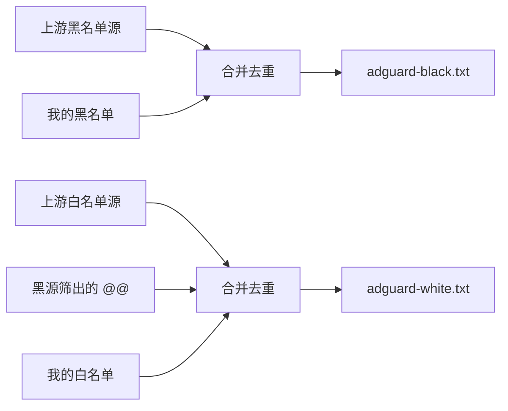

<div align="center">

# Rules Hub

**合并上游规则 · 转换为多平台可用的规则订阅**

<sub>AdGuard Home · mihomo · Surge · Quantumult X · dnsmasq · Pi-hole · SmartDNS · Shadowrocket</sub>

<br>

> 个人自用规则合集。AdGuard Home 输出为 DNS 专用域名规则；其他平台各自构建订阅。
> 规则内容均由上游作者维护，本仓库只做合并与格式转换，不做任何规则审查。
> 各平台的源、黑白名单都可以按自己的需求随意增删。

<br>

[](https://github.com/Ethereal-09/rules-hub/actions/workflows/merge.yml)
[](https://github.com/Ethereal-09/rules-hub)
[](https://github.com/Ethereal-09/rules-hub/actions)

[](#-订阅地址)
[](#-订阅地址)
[](#-上游源)

<sub>上次更新：2026-10-09 00:12:06 </sub>

</div>

---

## 订阅地址

### [](https://adguard.com)

| 类型 | 规则数 | 原始链接 | 加速 |
|:---|:---:|:---:|:---:|
| **黑名单** · 拦截 | 115,267 | [**订阅**](https://raw.githubusercontent.com/Ethereal-09/rules-hub/main/adguard/dist/adguard-black.txt) | [Boki](https://github.boki.moe/https://raw.githubusercontent.com/Ethereal-09/rules-hub/main/adguard/dist/adguard-black.txt) · [ghfast](https://ghfast.top/https://raw.githubusercontent.com/Ethereal-09/rules-hub/main/adguard/dist/adguard-black.txt) |
| **白名单** · 放行 | 58 | [**订阅**](https://raw.githubusercontent.com/Ethereal-09/rules-hub/main/adguard/dist/adguard-white.txt) | [Boki](https://github.boki.moe/https://raw.githubusercontent.com/Ethereal-09/rules-hub/main/adguard/dist/adguard-white.txt) · [ghfast](https://ghfast.top/https://raw.githubusercontent.com/Ethereal-09/rules-hub/main/adguard/dist/adguard-white.txt) |

> **提示**：以上为 AdGuard Home DNS 专用订阅，仅包含域名级拦截/例外；网页元素、URL 路径及重写规则不包含。直连被墙时可用加速链接 · [STATS.md](adguard/dist/STATS.md)

---

### [](Quantumult/)

| 类型 | 原始链接 | 加速 |
|:---|:---:|:---:|
| **完整配置** · 懒人订阅 | [**订阅**](https://raw.githubusercontent.com/Ethereal-09/rules-hub/main/Quantumult/dist/QuantumultX.conf) | [Boki](https://github.boki.moe/https://raw.githubusercontent.com/Ethereal-09/rules-hub/main/Quantumult/dist/QuantumultX.conf) · [ghfast](https://ghfast.top/https://raw.githubusercontent.com/Ethereal-09/rules-hub/main/Quantumult/dist/QuantumultX.conf) |

> [QX 懒人配置使用教程](Quantumult/%E4%BD%BF%E7%94%A8%E6%95%99%E7%A8%8B.md)

---

## 支持的平台

| 平台 | 目录 | 状态 |
|:---|:---:|:---:|
|  **AdGuard Home** | [`adguard/`](adguard/) | **已完成** |
|  **mihomo / Clash** | `mihomo/` | 计划中 |
|  **Surge** | `surge/` | 计划中 |
|  **Quantumult X · 完整配置** | [`Quantumult/`](Quantumult/) | **已完成，自动更新** |
|  **dnsmasq** | `dnsmasq/` | 计划中 |
|  **Pi-hole / hosts** | `pihole/` | 计划中 |
|  **SmartDNS** | `smartdns/` | 计划中 |
|  **Shadowrocket** | `shadowrocket/` | 计划中 |

> 每个平台**独立目录、独立源、独立合并**，互不影响。

---

## 合并逻辑



- **黑名单** = 上游黑名单源【合并 + 去重】+ 我的黑名单
- **白名单** = 上游白名单源【合并 + 去重】+ 黑源筛出的白名单 + 我的白名单
- 丢弃注释（`!`）、元数据（`[...]`）
- **统一转小写，再整行去重**
- 不做对冲 —— 黑白可能并存，交给引擎运行时裁决

---

## 目录结构

```
rules-hub/
├── adguard/                  # AdGuard Home
│   ├── black-sources.txt     # 黑名单源（一行一个 URL）
│   ├── white-sources.txt     # 白名单源（一行一个 URL）
│   ├── my-blacklist.txt      # 我的黑名单（一行一个裸域名）
│   ├── my-whitelist.txt      # 我的白名单（一行一个裸域名）
│   ├── merge.py              # 合并脚本
│   └── dist/                 # 输出（自动生成，勿手改）
├── Quantumult/               # QX 完整配置流水线及已启用资源
│   ├── dist/QuantumultX.conf   # 可直接导入的配置
│   ├── assets/                # 分流 / 重写 / 脚本镜像
│   └── SOURCES.md             # 镜像来源
└── .github/workflows/        # 自动合并与 QX 构建工作流
```

---

## 我的规则

在 `my-blacklist.txt` / `my-whitelist.txt` 里**一行一个裸域名**，脚本自动转换成对应平台格式：

| 文件 | 你写 | 输出 |
|:---|:---|:---|
| `my-blacklist.txt` | `ads.example.com` | `\|\|ads.example.com^` |
| `my-whitelist.txt` | `good.example.com` | `@@\|\|good.example.com^` |

> 修改上游源：编辑 `black-sources.txt` / `white-sources.txt`（`#` 开头为注释），push 后**自动触发合并**。

---

## 上游源

<details>
<summary><b>AdGuard Home · 黑名单源（11）</b></summary>
<br>

| 源 | 分类 |
|:---|:---|
| [AdGuard Base](https://github.com/AdguardTeam/FiltersRegistry) | 通用广告（官方） |
| [AdGuard Chinese](https://github.com/AdguardTeam/FiltersRegistry) | 中文广告（官方） |
| [EasyList](https://easylist.to/) | 英文通用（老牌） |
| [EasyList China](https://easylist.to/) | 中文通用（老牌） |
| [EasyPrivacy](https://easylist.to/) | 隐私追踪 |
| [xinggsf/Adblock-Plus-Rule](https://github.com/xinggsf/Adblock-Plus-Rule) | 国内视频去广告 |
| [cjx82630/cjxlist](https://github.com/cjx82630/cjxlist) | 国内 annoyances |
| [Noyllopa/NoAppDownload](https://github.com/Noyllopa/NoAppDownload) | 阻止 App 下载跳转 |
| [TG-Twilight/AWAvenue-Ads-Rule](https://github.com/TG-Twilight/AWAvenue-Ads-Rule) | 广告/隐私/不受欢迎 |
| [perflyst/SmartTV-AGH](https://github.com/perflyst/PiHoleBlocklist) | 智能电视 |
| [sjhgvr/oisd abp_small](https://github.com/sjhgvr/oisd) | 大而全（ABP 版） |

</details>

<details>
<summary><b>AdGuard Home · 白名单源（4）</b></summary>
<br>

| 源 | 分类 |
|:---|:---|
| [AdGuard Chinese allowlist](https://github.com/AdguardTeam/AdguardFilters) | 中文站误杀修复 |
| [AdGuard German allowlist](https://github.com/AdguardTeam/AdguardFilters) | 德文站误杀修复 |
| [AdGuard Turkish allowlist](https://github.com/AdguardTeam/AdguardFilters) | 土耳其站误杀修复 |
| [AdGuard Spyware allowlist](https://github.com/AdguardTeam/AdguardFilters) | 反误报 |

</details>

<details>
<summary><b>Quantumult X · 底包与分流源</b></summary>
<br>

| 源 | 分类 |
|:---|:---|
| [ddgksf2013/Profile](https://ddgksf2013.top/Profile/QuantumultX.conf) | 完整 QX 配置底包 |
| [ddgksf2013/Filter](https://github.com/ddgksf2013/Filter) | 自定义分流 |
| [blackmatrix7/ios_rule_script](https://github.com/blackmatrix7/ios_rule_script/tree/master/rule/QuantumultX) | 已启用的分流规则 |
| [VirgilClyne/GetSomeFries](https://github.com/VirgilClyne/GetSomeFries) | 中国 ASN 分流 |
| [ConnersHua/RuleGo](https://github.com/ConnersHua/RuleGo) | 代理分流 |
| [Cats-Team/AdRules](https://github.com/Cats-Team/AdRules) | 广告拦截分流 |

</details>

<details>
<summary><b>Quantumult X · 重写与脚本源</b></summary>
<br>

| 源 | 分类 |
|:---|:---|
| [ddgksf2013/Rewrite](https://github.com/ddgksf2013/Rewrite) | 去广告与功能重写 |
| [ddgksf2013/Scripts](https://github.com/ddgksf2013/Scripts) | 重写脚本 |
| [ddgksf2013.top](https://ddgksf2013.top/) | 已启用的重写与脚本资源 |
| [app2smile/rules](https://github.com/app2smile/rules) | 应用重写与脚本 |
| [Maasea/sgmodule](https://github.com/Maasea/sgmodule) | 视频重写脚本 |
| [chavyleung/scripts](https://github.com/chavyleung/scripts) | BoxJS 脚本 |
| [KOP-XIAO/QuantumultX](https://github.com/KOP-XIAO/QuantumultX) | QX 资源解析器与任务脚本 |

</details>


---

<div align="center">
<sub>Powered by <a href="https://github.com/Ethereal-09">Ethereal-09</a></sub>
</div>
