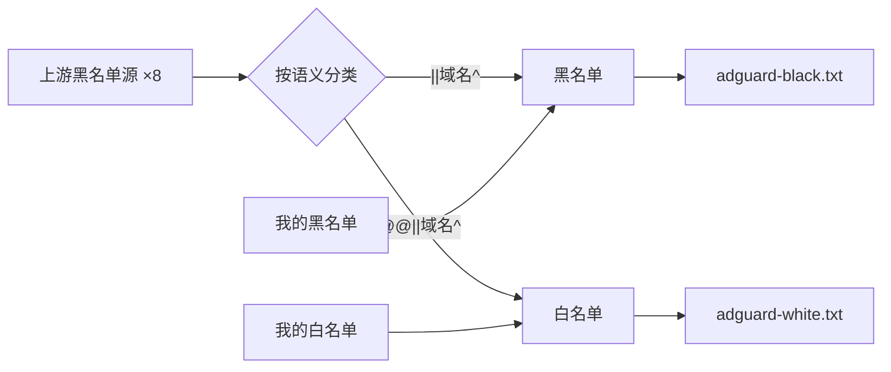
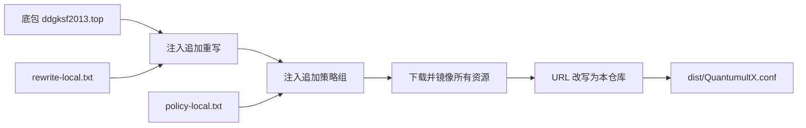

<div align="center">

# Rules Hub

**合并上游规则 · 转换为多平台可用的规则订阅**

<sub>AdGuard Home · Quantumult X</sub>

<br>

> 个人自用规则合集。把多个公开上游源合并去重，整理成各平台可直接订阅的格式。
> 规则内容均由上游作者维护，本仓库只做合并与格式转换，不做任何规则审查。
> 各平台的源、黑白名单都可以按自己的需求随意增删。

<br>

[](https://github.com/Ethereal-09/rules-hub/actions/workflows/merge.yml)
[](https://github.com/Ethereal-09/rules-hub/actions/workflows/quantumult.yml)
[](SOURCES.md)

[](#-订阅地址)
[](#-订阅地址)
[](#-订阅地址)
[](SOURCES.md)

<sub>上次更新：2026-10-10 10:57:14 </sub>

</div>

---

## 订阅地址

### AdGuard Home（DNS 层拦截）

| 类型 | 规则数 | 原始链接 | 加速 |
|:---|:---:|:---:|:---:|
| **黑名单** · 拦截 | 260,828 | [**订阅**](https://raw.githubusercontent.com/Ethereal-09/rules-hub/main/adguard/dist/adguard-black.txt) | [Boki](https://github.boki.moe/https://raw.githubusercontent.com/Ethereal-09/rules-hub/main/adguard/dist/adguard-black.txt) · [ghfast](https://ghfast.top/https://raw.githubusercontent.com/Ethereal-09/rules-hub/main/adguard/dist/adguard-black.txt) |
| **白名单** · 放行 | 32 | [**订阅**](https://raw.githubusercontent.com/Ethereal-09/rules-hub/main/adguard/dist/adguard-white.txt) | [Boki](https://github.boki.moe/https://raw.githubusercontent.com/Ethereal-09/rules-hub/main/adguard/dist/adguard-white.txt) · [ghfast](https://ghfast.top/https://raw.githubusercontent.com/Ethereal-09/rules-hub/main/adguard/dist/adguard-white.txt) |

> **提示**：直连被墙时用加速链接 · 详细统计见 [STATS.md](adguard/dist/STATS.md)

### Quantumult X（完整配置）

| 类型 | 内容 | 原始链接 |
|:---|:---|:---:|
| **完整配置** | 底包 + 17 条追加重写 + 策略组 | [**订阅**](https://raw.githubusercontent.com/Ethereal-09/rules-hub/main/Quantumult/dist/QuantumultX.conf) |
| **广告分流** | AdGuard 转换 + QX 原生源 | [**订阅**](https://raw.githubusercontent.com/Ethereal-09/rules-hub/main/Quantumult/dist/Quantumult-ads.list) |

> 每日 06:25 自动构建；可识别且安全的功能资源镜像到本仓库，跳过或少量失败的资源仍依赖上游。
> 详见 [使用教程](Quantumult/使用教程.md) · [镜像清单](Quantumult/SOURCES.md)

---

## 支持的平台

| 平台 | 目录 | 状态 |
|:---|:---:|:---:|
|  **AdGuard Home** | [`adguard/`](adguard/) | **已完成** |
|  **Quantumult X** | [`Quantumult/`](Quantumult/) | **已完成** |
|  **mihomo / Clash** | `mihomo/` | 计划中 |
|  **Surge** | `surge/` | 计划中 |
|  **dnsmasq** | `dnsmasq/` | 计划中 |
|  **Pi-hole / hosts** | `pihole/` | 计划中 |
|  **SmartDNS** | `smartdns/` | 计划中 |
|  **Shadowrocket** | `shadowrocket/` | 计划中 |

> 每个平台**独立目录、独立源、独立合并**，互不影响。

---

## 合并逻辑

**AdGuard Home** —— 只保留能在 DNS 层生效的域名规则：



- 非域名规则（元素隐藏、路径匹配）**直接丢弃** —— AGH 在 DNS 层执行不了
- 白名单**不设独立上游**，只由黑源中的 `@@` 例外与 `my-whitelist.txt` 生成
- 丢弃注释（`!`）、元数据（`[...]`）；只对纯域名规则小写化后去重

**Quantumult X** —— 镜像底包 + 注入个人条目：



- 底包是只读上游，个人改动通过两个 `*-local.txt` 注入
- 可识别且安全的功能资源（重写/脚本/分流）镜像到 `Quantumult/assets/`；跳过或少量失败的资源仍依赖上游
- 失败率超过阈值即拒绝发布，不会输出半成品配置

---

## 目录结构

```
rules-hub/
├── SOURCES.md                 # 上游来源清单 + 免责声明
├── README.md
├── adguard/                   # AdGuard Home
│   ├── black-sources.txt      # 黑名单源（一行一个 URL）
│   ├── white-sources.txt      # 白名单源（当前为空）
│   ├── my-blacklist.txt       # 我的黑名单（一行一个裸域名）
│   ├── my-whitelist.txt       # 我的白名单（一行一个裸域名）
│   ├── merge.py               # 合并脚本
│   └── dist/                  # 输出（自动生成）
├── Quantumult/                # Quantumult X
│   ├── build.py               # 构建入口
│   ├── rewrite-local.txt      # 追加重写（[rewrite_remote] 语法）
│   ├── policy-local.txt       # 追加策略组（[policy] 语法）
│   ├── lib/                   # 内部模块
│   ├── tests/                 # 单元测试
│   ├── assets/                # 镜像资源
│   └── dist/                  # 输出（自动生成）
├── qx/                        # 旧版 QX 目录（已废弃）
└── .github/workflows/         # 自动合并 / 构建工作流
```

---

## 我的规则

在 `my-blacklist.txt` / `my-whitelist.txt` 里**一行一个裸域名**，脚本自动转换成对应平台格式：

| 文件 | 你写 | 输出 |
|:---|:---|:---|
| `my-blacklist.txt` | `ads.example.com` | `\|\|ads.example.com^` |
| `my-whitelist.txt` | `good.example.com` | `@@\|\|good.example.com^` |

QX 的个人改动写在 `Quantumult/rewrite-local.txt` 与 `policy-local.txt`，
格式与底包一致，具体见 [Quantumult/README.md](Quantumult/README.md)。

> 修改任一源或本地规则后，push 即**自动触发对应流水线**。

---

## 上游源

完整的来源清单、授权说明与免责声明见 **[SOURCES.md](SOURCES.md)**。

<details>
<summary><b>AdGuard Home · 黑名单 8 源</b></summary>
<br>

| 源 | 说明 |
|:---|:---|
| damengzhu/banad · jiekouAD | 国内接口广告 |
| TG-Twilight/AWAvenue-Ads-Rule | 广告 / 隐私 / 不受欢迎 |
| hagezi/dns-blocklists · pro.mini | 综合 DNS 拦截（精简专业版） |
| oisd.nl · basic | 大而全 DNS 拦截（基础版） |
| Cats-Team/AdRules · dns.txt | 中文区广告与追踪 |
| AdguardTeam/AdFilters · adservers | 移动端广告服务器 |
| rssvcn/qy-Ads-Rule · black | 中文广告 |
| 2771936993/HG · hg1 | 综合拦截 |

白名单不设独立上游，由黑源中的 `@@` 例外与 `my-whitelist.txt` 生成。

</details>

<details>
<summary><b>Quantumult X · 底包与追加源</b></summary>
<br>

| 来源 | 用途 |
|:---|:---|
| [ddgksf2013.top](https://ddgksf2013.top/Profile/QuantumultX.conf) | QX 配置底包 |
| [ddgksf2013/Rewrite](https://github.com/ddgksf2013/Rewrite) | 17 条追加重写（AdBlock 系列） |
| [Cats-Team/AdRules](https://github.com/Cats-Team/AdRules) | QX 原生广告分流 |
| [Koolson/Qure](https://github.com/Koolson/Qure) · [Orz-3/mini](https://github.com/Orz-3/mini) | 策略组图标 |

</details>

---

## 自动化

| 工作流 | 触发 | 内容 |
|:---|:---|:---|
| **Merge Rules** | 每 8 小时 / 源文件变更 | 合并 AdGuard 黑白名单，转换 QX 广告分流 |
| **Build Quantumult X** | 每日 06:25 / 底包或本地规则变更 | 构建 QX 配置，镜像全部资源 |

两者都在构建前跑单元测试（AdGuard 18 例 · QX 43 例），任一失败即中止；
构建结果通过邮件通知，附触发提交的完整改动说明与运行记录链接。

---

> **免责声明**：本仓库为个人自用的规则合集，仅供学习与研究使用。
> 所有规则按「现状」提供，不附带任何担保；使用后果由使用者自行承担。
> 各上游规则的版权归其作者所有，详见 [SOURCES.md](SOURCES.md)。

---

<div align="center">
<sub>Powered by <a href="https://github.com/Ethereal-09">Ethereal-09</a></sub>
</div>
